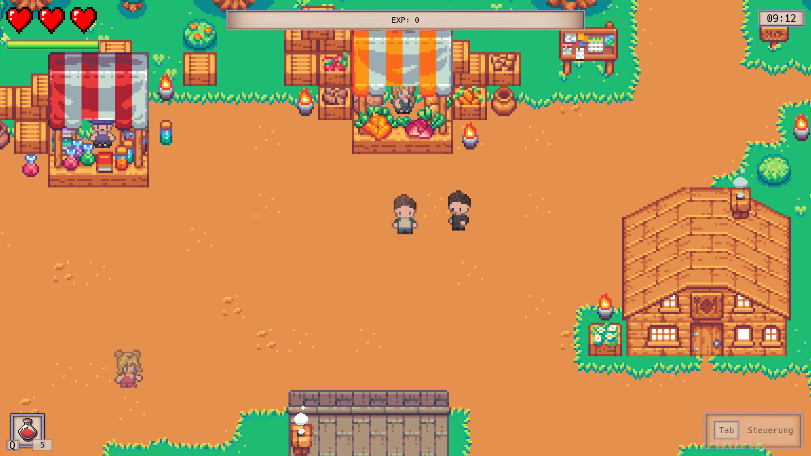

# Project Alpha

<p align="center">
    
</p>


## Übersicht
- [What is Project Alpha?](#whatisprojectalpha)
- [Features](#features)
- [Let's get started](#letsgetstarted)
    - [Method 1 - Run executable](#runexecutable)
    - [Method 2 - Compile yourself](#compileyourself)
- [Minimum system requirements](#minimumsystemrequirements)
- [Contributors](#contributors)


<a name="whatisprojectalpha"></a>

## What is Project Alpha?
Project Alpha is a pixel art game played from a bird's eye view. You can fight, trade and explore. All this in a beautiful environment surrounded by NPCs, enemies and animals. But watch out! The game requires a tactical approach in order not to die in the wilderness.

### Story
The year is 2433, Earth's resources and materials have been completely depleted by human greed. Earth is no longer a viable planet. There is garbage everywhere and more and more people die of epidemics or CO2 - poisoning. 

A research facility planned with last hope to find a new viable environment for a group of selected people and researchers. A black hole was discovered and raised the hope, of finding a new planet. That is where the group should travel, to start a new life and save humanity. The group set out on a mission. The mission "Project Alpha" was launched. 


<a name="features"></a>

## Features
Below are some of the features in this game:

### Maps
Many areas such as open terrain, dungeons or houses.
<p align="center">
    
    
    
</p>

### Day/night cycle
In the game there is a day/night cycle for which a shader is used.
<p align="center">
    
    
    
</p>

### Enemies & bosses
Many enemies can be met and defeated in the game. But beware of the bosses! The movement of the mobs was realized by implementing the AStar pathfinding.
<p align="center">
    
    
</p>

### Combat system
The player can defend himself against the opponents by defeating them with weapons. But the opponents are not easy to defeat, because they can defend themselves as well.
<p align="center">
    
</p>

### Loot & treasures
The mobs drop loot, but treasure can also be found on the maps.
<p align="center">
    
</p>

### NPCs & Quests
NPCs can be encountered in various areas. They walk around and can be talked to. Some of them can trade or give quests.
<p align="center">
    
    
    
</p>


<a name="letsgetstarted"></a>

## Let's get started
There are two methods to download and install the game:


<a name="runexecutable"></a>

### Method 1 - Run executable
1. **Download** the [latest release version](https://github.com/jensbeh/project-se-kassel-project-alpha/releases).
2. **Unpack** the *.zip* file
3. **Start** the *.exe* file
4. Have fun!

<a name="compileyourself"></a>

### Method 2 - Compile yourself
1. **Clone** the source code from GitHub:
    ```
    git clone https://github.com/jensbeh/project-se-kassel-project-alpha.git
    ```
2. **Start** your **Godot Engine** and open the project. 
3. Click on the **play icon** in the upper right corner and the engine will compile the code and **start the game**.
4. Have fun!


<a name="minimumsystemrequirements"></a>

## Minimum system requirements
These are the minimum system requirements that the game needs:
- **Processor:** At least dual-core CPU
- **Graphics card:** OpenGL 3.3 support; NVIDIA GeForce 400 or newer / AMD Radeon HD 7000 series
- **RAM:** At least 4GB, 8GB recommended
- **Memory:** At least 500MB


<a name="contributors"></a>

## Contributors
The game was implemented and designed by:
- [Tim Kolitsch](https://github.com/timme963)
- [Jens Behmenburg](https://github.com/jensbeh)